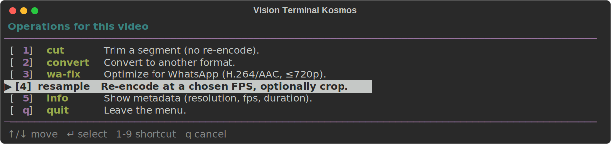

# Vision Terminal Kosmos

Professional CLI for **fast image and video processing** right from the terminal.
Built with [Typer](https://typer.tiangolo.com/), [Rich](https://rich.readthedocs.io/),
[OpenCV](https://opencv.org/), and [FFmpeg](https://ffmpeg.org/).

<p align="center">
  
</p>

---

## Commands

| Command    | What it does                                                     |
|------------|------------------------------------------------------------------|
| `cut`      | Cuts a video segment between `--start` and `--end` (no re-encode) |
| `convert`  | Converts images (PNG/JPG/WebP…) and videos (MP4/MKV/WebM/GIF)    |
| `wa-fix`   | Optimizes a video for WhatsApp (H.264 baseline, AAC, ≤720p)      |
| `batch`    | Applies conversion or resize to every file in a folder           |
| `info`     | Prints media metadata (resolution, fps, duration)                |

Running with no arguments (`./run.sh`) opens an **interactive Rich menu**
that stays open, prompts for inputs, runs the chosen operation, and loops
back until you press `q` to quit.

---

## Requirements

- **Python ≥ 3.10**
- **FFmpeg** available on `PATH`
  ```bash
  sudo apt install ffmpeg        # Debian/Ubuntu
  brew install ffmpeg            # macOS
  ```
- One of the following package managers:
  - [**uv**](https://docs.astral.sh/uv/) (recommended — fast)
    ```bash
    curl -LsSf https://astral.sh/uv/install.sh | sh
    ```
  - or plain `python3 -m venv` + `pip`.

---

## Configuration (one-time manual step)

The project **does not hard-code where the uv venv and cache should live** —
that is defined in a local `config.sh` file (gitignored), so every
collaborator keeps their own machine-specific paths.

```bash
cp config.sh.example config.sh
$EDITOR config.sh
```

Inside `config.sh` you choose:

```bash
# "uv" (recommended) or "venv" (standard Python)
export VTERM_BACKEND="uv"

# --- when VTERM_BACKEND="uv" ---
export UV_PROJECT_ENVIRONMENT="/mnt/hd3/uv-common/vtkosmos"
export UV_CACHE_DIR="/mnt/hd3/uv-cache"

# --- when VTERM_BACKEND="venv" ---
export VTERM_VENV_PATH="./.venv"
export VTERM_PYTHON="python3"
```

The `run.sh` launcher **sources** this file and activates / creates the
environment automatically. No manual `source .venv/bin/activate` needed.

> No `config.sh`? It still works: defaults apply (`VTERM_BACKEND=uv`, local
> `./.venv` if you pick `venv`) and a warning is printed.

---

## Activating the environment and launching the menu

### First-time setup

**1. Create your `config.sh`** (one-time, per collaborator):

```bash
cd vtkosmos
cp config.sh.example config.sh
# edit paths if needed: $EDITOR config.sh
```

**2. Make sure `uv` is installed** (if you chose the `uv` backend):

```bash
command -v uv || curl -LsSf https://astral.sh/uv/install.sh | sh
```

**3. Run the menu:**

```bash
chmod +x run.sh      # one-time
./run.sh             # opens the interactive Rich menu
```

On the **first run**, `uv` will sync dependencies into the directory
configured in `UV_PROJECT_ENVIRONMENT` (~30s). Subsequent runs are instant.

The menu works as a **loop**:

1. ASCII banner + command table are shown.
2. You pick a key: `1=cut`, `2=convert`, `3=wa-fix`, `4=batch`, `5=info`, `q=quit`.
3. Rich prompts you for each required argument (paths, times, quality, etc.),
   with sensible defaults pre-filled.
   - **Path prompts support TAB completion** (just like bash): type a few
     characters and hit `TAB` to auto-complete, or double-tap `TAB` to list
     candidates. `~` expands to your home directory.
4. A progress bar runs the operation; errors appear in a red panel.
5. You are asked *"Back to menu?"* — answer `y` to keep working or `n` to exit.

> `run.sh` takes care of everything:
> `source config.sh` → exports `UV_PROJECT_ENVIRONMENT` and `UV_CACHE_DIR` →
> `uv run vterm …`. **You never need to activate the venv manually.**

If you pass a subcommand directly (e.g. `./run.sh cut …`), the menu is
skipped and the CLI behaves as a classic one-shot command.

### Direct commands

```bash
./run.sh --help                                   # help with banner
./run.sh info video.mp4                           # metadata
./run.sh cut video.mp4 --start 00:10 --end 00:45  # cut segment
./run.sh convert photo.png photo.webp --quality 90
./run.sh wa-fix meeting.mov                       # produces meeting_wa.mp4
./run.sh batch ./photos --to .webp                # convert whole folder
./run.sh batch ./photos --resize 1280             # resize (longest side)
```

### Activate the venv manually (optional)

If you'd rather call `vterm` directly, without the wrapper:

```bash
# uv backend
source config.sh
source "$UV_PROJECT_ENVIRONMENT/bin/activate"
vterm                          # menu
vterm cut video.mp4 -s 0:10 -e 0:45

# venv backend
source config.sh
source "$VTERM_VENV_PATH/bin/activate"
vterm
```

### Global installation (optional)

To call `vterm` from any directory, without `./run.sh`:

```bash
# via uv (recommended)
uv tool install .

# or via pip
pip install -e .
```

Then:

```bash
vterm --help
vterm cut video.mp4 -s 00:10 -e 00:45
```

---

## Architecture

```
vtkosmos/
├── config.sh.example        # local config template (tracked in git)
├── config.sh                # your config (gitignored)
├── run.sh                   # launcher: source config + exec CLI
├── pyproject.toml           # dependencies and entry points
└── src/vtermkosmos/
    ├── main.py              # Typer app — command routing only
    ├── cli_ui.py            # Rich: banner, tables, panels, progress
    ├── menu.py              # interactive Rich menu loop
    └── processor.py         # OpenCV + ffmpeg — all media logic
```

- **`processor.py`** knows nothing about the terminal — easy to test and reuse.
- **`cli_ui.py`** centralizes colors, banner, error panels, and progress bars.
- **`main.py`** is a thin Typer routing layer.

---

## Development

```bash
# with uv
uv sync
uv run vterm --help

# with pip/venv
python -m venv .venv && source .venv/bin/activate
pip install -e .
vterm --help
```

Processor errors (missing file, unsupported codec, ffmpeg not installed) are
caught and rendered as a red Rich panel — never as a raw traceback.

---

## License

MIT © Helton Maia
